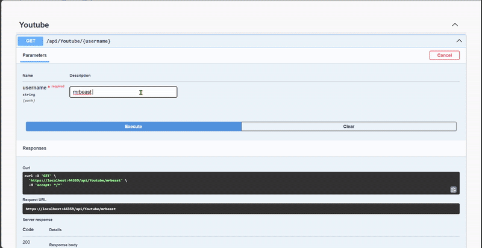

<div align="center">
  <a href="https://git.io/typing-svg">
    
  </a>

  <h5 align="center"> 
    <b>✅ Completo</b>
  </h5>
</div>

<div align="center">
<h1>Demostração</h1> 
</div>

<h1 align="center">
   
</h1>

 
 
 


Este projeto foi desenvolvido com o objetivo de integrar aplicações corporativas da FIESP à **API do YouTube**, possibilitando a obtenção de dados de canais e vídeos públicos por meio de chamadas autenticadas com chave de API.  
Utilizando **.NET 8**, **C#**, e boas práticas de arquitetura, o sistema implementa design patterns como **Injeção de Dependência**, **DTOs** e **Interfaces** para manter a separação de responsabilidades, testabilidade e escalabilidade do código.

---

### 🔧 Funcionalidades

- Buscar informações de um canal a partir do nome de usuário
- Listar os 5 vídeos mais recentes do canal, incluindo:
  - Título
  - Thumbnail
  - Data de publicação
  - Visualizações, Likes e Comentários

---

### 📦 Tecnologias e Conceitos Utilizados

- `.NET 8`
- `C#`
- `Google.Apis.YouTube.v3`
- `Dependency Injection (DI)`
- `Data Transfer Objects (DTO)`
- `IOptions pattern` para configuração
- `Design Patterns` para desacoplamento e modularização
- `Camadas organizadas`: Dtos, Interfaces, Models, Services

---
### 📤 Exemplo de Retorno da API

```json
{
  "nomeCanal": "AM3NlC",
  "descricao": "",
  "canalId": "UCrGnb5RdHA9M6WGmBGYo4ZQ",
  "ultimosVideos": [
    {
      "titulo": "USANDO ÓCULOS ESPIÃO COM MEUS AMIGOS ‹ EduKof ›",
      "thumbnailUrl": "https://i.ytimg.com/vi/OCdmrboSfTA/mqdefault.jpg",
      "publicadoEm": "2025-05-06T11:45:03",
      "visualizacoes": 66555,
      "likes": 8762,
      "comentarios": 203,
      "videoId": "OCdmrboSfTA",
      "url": "https://www.youtube.com/watch?v=OCdmrboSfTA"
    }
  ]
}
```

<div align="center">

## 👩🏻‍💻 Autor <br>

<table>
  <tr>
    <td align="center">
      <a href="https://github.com/robsonlmds">
        <br>
        <sub>
          <b>Robson Lucas Messias</b>
        </sub>
      </a>
    </td>
  </tr>
</table>

</div>
 
<h4 align="center">
  Made by: Robson Lucas Messias | <a href="mailto:robsonlmds@hotmail.com">Contato</a>
</h4>

<p align="center">
  <a href="https://www.linkedin.com/in/r-lucas-messias/">
    
  </a>
</p>

<h1 align="center">

</h1>
